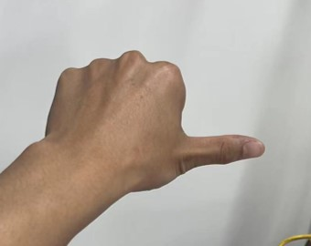

English| [简体中文](./README_cn.md)

# Feature Introduction

The gesture_control app allows for controlling the movement of the small R robot car through gestures, including left and right rotation, as well as forward and backward translation.

The supported control gestures and their definitions are listed in the table below:

| Gesture Name          | Function Definition | Gesture Example                                              |
| --------------------- | ------------------- | ------------------------------------------------------------ |
| 666 gesture/Awesome   | Forward             |  |
| yeah/Victory          | Backward            |  |
| ThumbRight            | Right Turn          |  |
| ThumbLeft             | Left Turn           |  |
| OK/Okay               | Wake Up             |  |
| Palm                  | Reset               |  |

Among these gestures, thumbs up, yeah, thumb right, and thumb left are used for controlling the robot's forward, backward, or rotation movements. The OK gesture is for waking up the gesture control function, while the palm gesture is for resetting the control function. Detailed control instructions are as follows:

## Wake Up Gesture

The wake up gesture is used to activate the gesture control of the robot.

When the wake up gesture is enabled, only the hand that performs the wake up gesture can control the robot through the 4 control gestures. This is generally used in scenarios with many people and complex environments to avoid unintentional triggering of the gesture control function.

When the wake up gesture is not enabled, the control of the robot is directly triggered by the 4 control gestures mentioned above.

## Reset Gesture

The reset gesture is used to reset the gesture control of the robot. The reset gesture is only effective when the wake up gesture is enabled.

When a reset gesture is recognized, the gesture control function is reset, and a new control hand is selected.

## Selection of Control Hand

When the wake up gesture is enabled, the hand that performs the wake up gesture will act as the controller, and only this hand can control the movement of the robot.

When the wake up gesture is not enabled, the hand that performs the aforementioned 4 control gestures will be selected as the controller.

When selecting the control hand, if multiple hands perform gestures simultaneously, the hand with the widest bounding box width will be chosen as the controller.

If there is already a controller, other hands performing wake up gestures or control gestures will be invalid.

Only when the hand acting as the controller disappears or makes a reset gesture will a new controller be searched for. If a hand (controller) is not detected for track_serial_lost_num_thr frames in a row (default 100 frames), it is considered that the hand (controller) has disappeared.

## Control Strategy

Once the hand acting as the controller is identified, the strategy for handling intelligent input results for each frame is as follows:

If there is no control hand in the current frame, the robot's movement will stop.

If there is a control hand in the current frame, it will be determined whether this hand is making a control gesture. If not, the robot's movement will stop; if yes, the robot will be controlled to perform the corresponding movement.# User Manual

## Dependencies

### Hardware Requirements

You will need a Xiaorui robot car, including an X3 development board (X3 sdb or X3 Pi) and a camera sensor (USB or MIPI camera) installed.

The launch file by default uses a USB camera.

### Software Requirements

The X3 development board (X3 sdb or X3 Pi) should have the X3 Ubuntu/Linux system installed, along with the deployment package "install" compiled using the all_build.sh setup script (full compilation mode). The deployment package contains the following packages required to run this APP:

- mipi_cam package: publish image messages
- hobot_codec package: jpeg image encoding & publishing
- mono2d_body_detection package: publish human body, head, face, and hand bounding perception messages
- hand_lmk_detection package: publish hand key point perception messages
- hand_gesture_detection package: publish gesture recognition result messages
- websocket package: render images and AI perception messages
- gesture_control package: gesture interaction
- xrrobot package: Xiaorui robot car motion control driver

Note! Launch files can only be run on the X3 Ubuntu system.

## Execution

Copy the TogetherROS deployment package "install" to the Horizon X3 development board (if compiling on X3, ignore the copying step), and run the following command:

### **Ubuntu**

```
export COLCON_CURRENT_PREFIX=./install
source ./install/setup.bash
# The config path here is an example path for the models used. Copy according to the actual installation path.
# If compiling on-device (without the --merge-install compilation option), the copy command is cp -r install/PKG_NAME/lib/PKG_NAME/config/. where PKG_NAME is the specific package name.
cp -r install/lib/mono2d_body_detection/config/.
cp -r install/lib/hand_lmk_detection/config/.
cp -r install/lib/hand_gesture_detection/config/.

# Start the launch file, which includes enabling gesture activation.
ros2 launch install/share/hobot_app_xrrobot_gesture_control/launch/hobot_app_xrrobot_gesture_control.launch.py
```

### **Linux**

```
export ROS_LOG_DIR=/userdata/
export LD_LIBRARY_PATH=${LD_LIBRARY_PATH}:./install/lib/
```# Configuration for example models, copy based on actual installation path
cp -r install/lib/mono2d_body_detection/config/ .
cp -r install/lib/hand_lmk_detection/config/ .
cp -r install/lib/hand_gesture_detection/config/ .

# Start image publishing package
./install/lib/mipi_cam/mipi_cam --ros-args -p out_format:=nv12 -p image_width:=960 -p image_height:=544 -p io_method:=shared_mem --log-level error &
# Start jpeg image encoding & publishing package
./install/lib/hobot_codec/hobot_codec_republish --ros-args -p channel:=1 -p in_mode:=shared_mem -p in_format:=nv12 -p out_mode:=ros -p out_format:=jpeg -p sub_topic:=/hbmem_img -p pub_topic:=/image_jpeg --ros-args --log-level error &
# Start monocular RGB body, head, face, hand bounding box and key point detection package
./install/lib/mono2d_body_detection/mono2d_body_detection --ros-args --log-level error &
# Start hand key point detection package
./install/lib/hand_lmk_detection/hand_lmk_detection --ros-args --log-level error &
# Start web presentation package
./install/lib/websocket/websocket --ros-args -p image_topic:=/image_jpeg -p image_type:=mjpeg -p smart_topic:=/hobot_hand_gesture_detection --log-level error &

# Start gesture recognition package
./install/lib/hand_gesture_detection/hand_gesture_detection --log-level error &

# Start robot motion package
./install/lib/xrrobot/xrrobot --log-level error &

# Start gesture interaction package
./install/lib/gesture_control/gesture_control --ros-args -p activate_wakeup_gesture:=1
```

## Note

1. Launch is used on the board side, dependencies need to be installed with the command: `pip3 install lark-parser`. Configuration only needs to be done once on the device and doesn't need to be configured again after power-off and restart.
2. To start the robot motion package, driver configuration is needed: `cp install/lib/xrrobot/config/58-xrdev.rules /etc/udev/rules.d/`, copy it and restart the X3 development board. Configuration only needs to be done once on the device and doesn't need to be configured again after power-off and restart.
3. When running the web presentation for the first time, the webserver service needs to be started as follows:

- cd to the deployment path of websocket: `cd install/lib/websocket/webservice/` (if compiled on the board (without the --merge-install compilation option), the command to execute would be `cd install/websocket/lib/websocket/webservice`)
- Start nginx: `chmod +x ./sbin/nginx && ./sbin/nginx -p .`
- Configuration needs to be redone after device restart.

# Result Analysis

## X3 Result Display

```

[gesture_control-7] [WARN] [1652965757.145607222] [GestureControlEngine]: Gesture contrl start!, track_id: 2, frame_ts_ms: 3698315325, tracking_sta(0:INITING, 1:TRACKING, 2:LOST): 1, gesture: 11
[gesture_control-7] [WARN] [1652965757.159500951] [GestureControlEngine]: frame_ts_ms: 3698315358, track_id: 2, tracking_sta: 1, gesture: 14
[gesture_control-7] [WARN] [1652965757.159660358] [GestureControlEngine]: do move, direction: 0, step: 0.500000
[gesture_control-7] [WARN] [1652965757.211420964] [GestureControlEngine]: frame_ts_ms: 3698315425, track_id: 2, tracking_sta: 1, gesture: 14
[gesture_control-7] [WARN] [1652965757.211624899] [GestureControlEngine]: do move, direction: 0, step: 0.500000
[gesture_control-7] [WARN] [1652965757.232051230] [GestureControlEngine]: frame_ts_ms: 3698315457, track_id: 2, tracking_sta: 1, gesture: 14
[gesture_control-7] [WARN] [1652965757.232207513] [GestureControlEngine]: do move, direction: 0, step: 0.500000
```The log snippet above captures part of the processing results of controlling the movement of a small car through gestures. Due to the activation of gesture activation in the launch file, in the frame with timestamp frame_ts_ms: 3698315325, the gesture "OK" (gesture: 11) activated the gesture control function. Starting from the timestamp frame_ts_ms: 3698315358, the car was controlled to move forward at a speed of 0.5m/s (do move, direction: 0, step: 0.500000) through the gesture "666" (gesture: 14). In the frame with timestamp frame_ts_ms 3698315655, the gesture "palm" (gesture: 5) reset the car's movement control function and stopped the car from moving (cancel move).

## Web Effect Display

# Frequently Asked Questions

1. When running the startup command on Ubuntu, an error `-bash: ros2: command not found` occurs.

The ROS2 environment is not set in the current terminal. Run the following commands to set up the environment:
```
export COLCON_CURRENT_PREFIX=./install
source ./install/setup.bash
```

Execute a `ros2` command in the current terminal to confirm if the ROS2 environment is effective:
```
# ros2
usage: ros2 [-h] Call `ros2 <command> -h` for more detailed usage. ...

ros2 is an extensible command-line tool for ROS 2.
```

If the above information is displayed, the ROS2 environment is successfully configured.

Note: For each new terminal, the ROS2 environment needs to be set up again.

2. Making a control gesture but the car does not move.

2.1 Check if the car movement control package is started successfully.

Open a new terminal and run the `top` command to see if there is an `xrrobot` process. If not, verify if the configuration file `/etc/udev/rules.d/58-xrdev.rules` exists. If it does not exist, configure it according to the "Notes" section in the "Instructions".

2.2 Check if the gestures are recognized.

After making a control gesture, check if the value of the keyword "tracking_sta" in the output log is 1 and if the gesture value is greater than 0. Otherwise, refer to the examples of gesture actions in the "Function Introduction" section to confirm if the gestures are standard.

2.3 Check if gesture control is activated.

The launch file configuration enables gesture activation. The gesture control of the car can only be done through gestures after activating the gesture control feature with the "OK" gesture.2.4 Issuing Motion Control Commands to the Robot

Open a new terminal (only valid for Ubuntu systems) and execute the command to control the robot's movement: `ros2 topic pub -r 10 /cmd_vel geometry_msgs/Twist '{linear: {x: 0, y: 0, z: 0}, angular: {x: 0, y: 0, z: 0.1}}'` to confirm if the robot is moving correctly. If the robot does not rotate, check the robot's motion control module.

3. No Log Information Output in the Terminal

3.1 Confirm if all nodes in the launch file have started successfully

Open a new terminal (only valid for Ubuntu systems) and execute the `top` command to check if the nodes in the launch file are all running. If not, use the `ros2 run` command to start the corresponding node separately to determine the reason for startup failure.

3.2 Check if each node is publishing messages

Based on the topic names configured for publishing and subscribing in the launch file, use the `ros2 topic echo` command (only valid for Ubuntu systems) to display whether each topic has any messages being published. If not, investigate the reason for the lack of publications.

Note! If running the `ros2 topic` command fails, execute the command to install dependencies: `pip3 install netifaces`