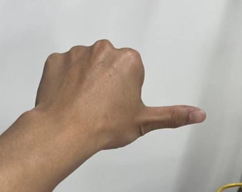

[English](./README.md) | 简体中文

# 功能介绍

gesture_control app功能为通过手势控制小R机器人小车运动，包括左右旋转和前后平移运动。

支持的控制手势和手势功能定义如下表格：

| 手势名称              | 功能定义 | 手势动作举例                                     |
| --------------------- | -------- | ------------------------------------------------ |
| 666手势/Awesome       | 前进     |        |
| yeah/Victory          | 后退     |           |
| 大拇指向右/ThumbRight | 右转     |  |
| 大拇指向左/ThumbLeft  | 左转     |    |
| OK/Okay               | 唤醒     |              |
| 手掌/Palm             | 重置     |              |

其中点赞、yeah、大拇指向右和大拇指向左4种手势用于控制机器人前后或旋转运动。OK手势用于手势控制唤醒功能，手掌手势用于重置控制功能，详细的控制说明如下：

## 唤醒手势

唤醒手势用于唤醒通过手势控制机器人的功能。

当启用唤醒手势时，只有做了唤醒手势的hand才能通过4种控制手势控制机器人。一般用于人较多，环境复杂的场景，通过启用唤醒手势避免误触发手势控制功能。

当未启用唤醒手势时，直接通过上述4种控制手势触发控制机器人功能。

## 重置手势

重置手势用于重置手势控制机器人的功能。只有当启用了唤醒手势时，重置手势才有效。

当识别到控制手作出重置手势时，重置手势控制功能，重新选择控制手。

## 控制手（controler）的选择

当启用唤醒手势时，做唤醒手势的hand会作为controler，只有这个hand做手势才能控制机器人运动。

当未启用唤醒手势时，选择做了上述4种控制手势的hand作为controler。

选择控制手时，如果有多个hand同时做手势，选择hand检测框宽度最大的hand作为controler。

已有controler的情况下，其他hand做唤醒手势或者控制手势都无效。

只有当作为controler的hand消失或者做出重置手势时，才会重新寻找新的controler。连续track_serial_lost_num_thr（默认100）帧未检测到hand，判断hand（controler）消失。

## 控制策略

已找到作为controler的hand后，对于每一帧输入的智能结果处理策略如下：

当前帧中无此控制手，停止机器人运动。

当前帧中有此控制手，判断此hand有无控制手势，如无，停止机器人运动，如有，控制机器人做对应的运动。

# 使用介绍

## 依赖

### 硬件依赖

具备小R机器人小车，包括安装了X3开发板（X3 sdb或者X3 Pi）和camera传感器（USB或MIPI camera）。

launch启动文件默认配置使用的是usb camera。

### 软件依赖

X3开发板（X3 sdb或者X3 Pi）安装了X3 Ubuntu/Linux系统，以及使用all_build.sh配置脚本（完整编译模式）配置编译出来的TogetherROS部署包install，部署包中包含运行此APP所需的以下package：

- mipi_cam package：发布图片msg
- hobot_codec package：jpeg图片编码&发布
- mono2d_body_detection package：发布人体、人头、人脸、人手框感知msg
- hand_lmk_detection package：发布人手关键点感知msg
- hand_gesture_detection package：发布手势识别结果msg
- websocket package：渲染图片和ai感知msg
- gesture_control package：手势交互
- xrrobot package：小R机器人小车运动控制驱动

注意！只有X3 Ubuntu系统支持使用launch文件运行。

## 运行

将TogetherROS部署包install拷贝到地平线X3开发板上（如果是在X3上编译，忽略拷贝步骤），并执行如下命令运行：

### **Ubuntu**

```
export COLCON_CURRENT_PREFIX=./install
source ./install/setup.bash
# config中为示例使用的模型，根据实际安装路径进行拷贝
# 如果是板端编译（无--merge-install编译选项），拷贝命令为cp -r install/PKG_NAME/lib/PKG_NAME/config/ .，其中PKG_NAME为具体的package名。
cp -r install/lib/mono2d_body_detection/config/ .
cp -r install/lib/hand_lmk_detection/config/ .
cp -r install/lib/hand_gesture_detection/config/ .

#启动launch文件，文件中配置使能了激活手势
ros2 launch install/share/hobot_app_xrrobot_gesture_control/launch/hobot_app_xrrobot_gesture_control.launch.py
```

### **Linux**

```
export ROS_LOG_DIR=/userdata/
export LD_LIBRARY_PATH=${LD_LIBRARY_PATH}:./install/lib/

# config中为示例使用的模型，根据实际安装路径进行拷贝
cp -r install/lib/mono2d_body_detection/config/ .
cp -r install/lib/hand_lmk_detection/config/ .
cp -r install/lib/hand_gesture_detection/config/ .

# 启动图片发布pkg
./install/lib/mipi_cam/mipi_cam --ros-args -p out_format:=nv12 -p image_width:=960 -p image_height:=544 -p io_method:=shared_mem --log-level error &
# 启动jpeg图片编码&发布pkg
./install/lib/hobot_codec/hobot_codec_republish --ros-args -p channel:=1 -p in_mode:=shared_mem -p in_format:=nv12 -p out_mode:=ros -p out_format:=jpeg -p sub_topic:=/hbmem_img -p pub_topic:=/image_jpeg --ros-args --log-level error &
# 启动单目rgb人体、人头、人脸、人手框和人体关键点检测pkg
./install/lib/mono2d_body_detection/mono2d_body_detection --ros-args --log-level error &
# 启动人手关键点检测pkg
./install/lib/hand_lmk_detection/hand_lmk_detection --ros-args --log-level error &
# 启动web展示pkg
./install/lib/websocket/websocket --ros-args -p image_topic:=/image_jpeg -p image_type:=mjpeg -p smart_topic:=/hobot_hand_gesture_detection --log-level error &

# 启动手势识别pkg
./install/lib/hand_gesture_detection/hand_gesture_detection --log-level error &

# 启动小车运动pkg
./install/lib/xrrobot/xrrobot --log-level error &

# 启动手势交互pkg
./install/lib/gesture_control/gesture_control --ros-args -p activate_wakeup_gesture:=1
```

## 注意事项

1. 板端使用launch启动，需要安装依赖，安装命令：`pip3 install lark-parser`。设备上只需要配置一次，断电重启不需要重新配置。
2. 启动小车运动pkg，需要配置驱动：`cp install/lib/xrrobot/config/58-xrdev.rules /etc/udev/rules.d/`，拷贝后重启X3开发板。设备上只需要配置一次，断电重启不需要重新配置。
3. 第一次运行web展示需要启动webserver服务，运行方法为:

- cd 到websocket的部署路径下：`cd install/lib/websocket/webservice/`（如果是板端编译（无--merge-install编译选项）执行命令为`cd install/websocket/lib/websocket/webservice`）
- 启动nginx：`chmod +x ./sbin/nginx && ./sbin/nginx -p .`
- 设备重启需要重新配置。

# 结果分析

## X3结果展示

```

[gesture_control-7] [WARN] [1652965757.145607222] [GestureControlEngine]: Gesture contrl start!, track_id: 2, frame_ts_ms: 3698315325, tracking_sta(0:INITING, 1:TRACKING, 2:LOST): 1, gesture: 11
[gesture_control-7] [WARN] [1652965757.159500951] [GestureControlEngine]: frame_ts_ms: 3698315358, track_id: 2, tracking_sta: 1, gesture: 14
[gesture_control-7] [WARN] [1652965757.159660358] [GestureControlEngine]: do move, direction: 0, step: 0.500000
[gesture_control-7] [WARN] [1652965757.211420964] [GestureControlEngine]: frame_ts_ms: 3698315425, track_id: 2, tracking_sta: 1, gesture: 14
[gesture_control-7] [WARN] [1652965757.211624899] [GestureControlEngine]: do move, direction: 0, step: 0.500000
[gesture_control-7] [WARN] [1652965757.232051230] [GestureControlEngine]: frame_ts_ms: 3698315457, track_id: 2, tracking_sta: 1, gesture: 14
[gesture_control-7] [WARN] [1652965757.232207513] [GestureControlEngine]: do move, direction: 0, step: 0.500000
[gesture_control-7] [WARN] [1652965757.595528850] [GestureControlEngine]: frame_ts_ms 3698315655, track id: 2 recved reset gesture: 5
[gesture_control-7] [WARN] [1652965757.595700337] [GestureControlEngine]: cancel move
```

以上log截取了部分通过手势控制小车运动的处理结果。由于launch文件中配置启用了手势激活功能，在时间戳frame_ts_ms: 3698315325的帧中，通过OK手势（gesture: 11）激活了手势控制功能，从时间戳frame_ts_ms: 3698315358开始通过666手势（gesture: 14）控制小车以0.5m/s的速度前进运动（do move, direction: 0, step: 0.500000）。在时间戳frame_ts_ms 3698315655的帧中，通过手掌手势（gesture: 5）重置了小车运动控制功能，同时使小车停止运动（cancel move）。

## web效果展示


# 常见问题

1、Ubuntu下运行启动命令报错`-bash: ros2: command not found`

当前终端未设置ROS2环境，执行命令配置环境：

```
export COLCON_CURRENT_PREFIX=./install
source ./install/setup.bash
```

在当前终端执行ros2命令确认当前终端环境是否生效：

```
# ros2
usage: ros2 [-h] Call `ros2 <command> -h` for more detailed usage. ...

ros2 is an extensible command-line tool for ROS 2.

optional arguments:
  -h, --help            show this help message and exit
```

如果输出以上信息，说明ros2环境配置成功。

注意！对于每个新打开的终端，都需要重新设置ROS2环境。

2、做出控制手势，小车不运动

2.1 检查小车运动控制pkg是否启动成功

重新开启一个终端，执行top命令查看是否有xrrobot进程，如果无，确认/etc/udev/rules.d/58-xrdev.rules配置文件是否存在，如果不存在，按照“使用介绍”章节的“注意事项”进行配置。

2.2 检查是否识别到手势

做出控制手势后，查看输出log中“tracking_sta”关键字值是否为1，同时gesture值是否大于0，否则按照“功能介绍”部分手势动作举例确认手势是否标准。

2.3 手势控制是否激活

launch文件中配置使能了激活手势，必须先使用“OK”手势激活手势控制功能才能通过手势控制小车。

2.4 向小车发布运动控制命令

重新开启一个终端（仅对Ubuntu系统有效），执行命令控制小车转动：`ros2 topic pub -r 10 /cmd_vel geometry_msgs/Twist '{linear: {x: 0, y: 0, z: 0}, angular: {x: 0, y: 0, z: 0.1}}'`，用于确认小车运动是否正常。如果小车不转动，检查小车的运动控制模块。

3、终端无log信息输出

3.1 确认launch文件中的node是否都启动成功

重新开启一个终端（仅对Ubuntu系统有效），执行top命令查看launch文件中的node进程是否都在运行，否则使用ros2 run命令单独启动相关node确认启动失败原因。

3.2 查看每个node是否都有发布msg

根据launch文件中每个node配置的发布和订阅的topic名，使用ros2 topic echo（仅对Ubuntu系统有效）命令显示每个topic是否有消息发布，如果无，再确认没有发布的原因。

注意！如果运行ros2 topic命令失败，执行命令安装依赖：`pip3 install netifaces`
